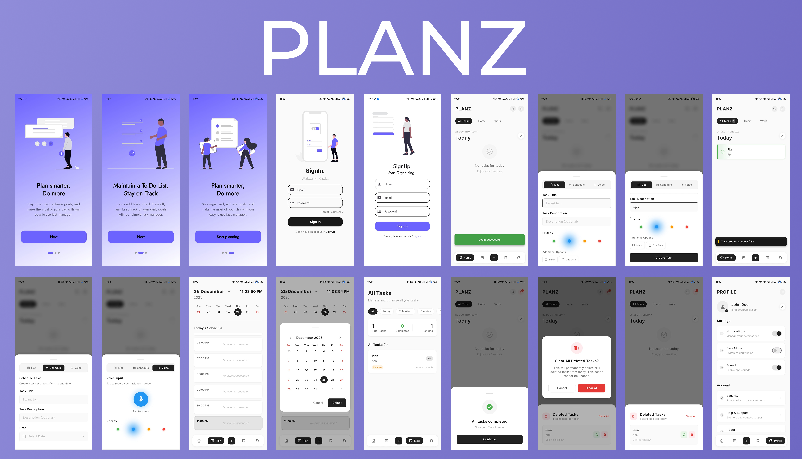

# Planz 📋

A modern, feature-rich task management Flutter application with voice input, scheduling, and Firebase authentication.


## 📸 App Overview 



## 📱 Features

### Core Functionality
- ✅ **Task Management** - Create, edit, and delete tasks with descriptions
- 🎯 **Priority System** - Four priority levels (Low, Medium, High, Urgent) with color coding
- 📅 **Task Scheduling** - Schedule tasks with specific dates and times
- 🗑️ **Soft Delete** - Deleted tasks can be restored from trash
- 🔍 **Search** - Search through your tasks quickly
- 📊 **Task Statistics** - View completed, pending, and total task counts

### Advanced Features
- 🎤 **Voice Input** - Create tasks using voice commands with natural language processing
- 🗓️ **Calendar View** - Week and month calendar views for scheduled tasks
- ⏰ **Timeline View** - 24-hour timeline showing hourly task schedule
- 🎨 **Custom UI** - Modern, gradient-based UI with smooth animations
- 🔔 **Task Filters** - Filter by Today, This Week, Overdue, and Completed
- 💾 **Local Storage** - Tasks persist locally using Hive database

### User Experience
- 🔐 **Firebase Authentication** - Secure login and registration
- 👤 **User Profiles** - Personal profile management
- 🌙 **Dark Mode Ready** - Theme customization options
- 📳 **Haptic Feedback** - Tactile responses for user interactions
- 🎭 **Onboarding** - Beautiful onboarding screens for new users

## 🛠️ Tech Stack

### Frontend
- **Flutter** - Cross-platform UI framework
- **Riverpod** - State management solution
- **Google Fonts** - Custom typography (Inter, Jost)
- **flutter_svg** - SVG asset rendering
- **table_calendar** - Calendar widget implementation
- **smooth_page_indicator** - Page indicator for onboarding

### Backend & Database
- **Firebase Auth** - User authentication
- **Cloud Firestore** - User data storage
- **Hive** - Local task storage and caching

### Voice & AI
- **speech_to_text** - Voice recognition
- **Custom NLP Parser** - Natural language task parsing

### UI Components
- **dotted_border** - Decorative borders
- **rive** - Advanced animations
- **intl** - Date/time formatting

## 📁 Project Structure

```
planz/
├── lib/
│   ├── auth/
│   │   ├── login.dart              # Login screen
│   │   └── register.dart           # Registration screen
│   ├── LandingPages/
│   │   ├── landing.dart            # Onboarding page 1
│   │   ├── landing2.dart           # Onboarding page 2
│   │   ├── landing3.dart           # Onboarding page 3
│   │   └── landingmain.dart        # Onboarding controller
│   ├── pages/
│   │   ├── Home.dart               # Main task list view
│   │   ├── List.dart               # Filtered tasks view
│   │   ├── Schedule.dart           # Calendar & timeline view
│   │   ├── Profile.dart            # User profile & settings
│   │   ├── PageNav.dart            # Bottom navigation
│   │   ├── voice.dart              # Voice input screen
│   │   ├── voice_command_parser.dart # NLP for voice commands
│   │   └── deleted_pages.dart      # Trash/deleted tasks
│   ├── providers/
│   │   ├── task_notifier.dart      # Task state management
│   │   └── task_provider.dart      # Riverpod providers
│   ├── Widgets/
│   │   ├── bottom_task_sheet.dart  # Task creation bottom sheet
│   │   ├── task_card.dart          # Swipeable task card
│   │   ├── customtextfield.dart    # Reusable text fields
│   │   └── color_wheel_picker.dart # Color picker widget
│   ├── router.dart                 # App routing
│   └── main.dart                   # App entry point
├── assets/
│   └── *.svg                       # SVG illustrations
├── pubspec.yaml                    # Dependencies
└── README.md
```

## 🚀 Getting Started

### Prerequisites

- Flutter SDK (latest stable version)
- Dart SDK (comes with Flutter)
- Firebase project setup
- Android Studio / VS Code
- iOS development: Xcode (macOS only)

### Installation

1. **Clone the repository**
```bash
git clone https://github.com/harshit36singh/Planz.git
cd Planz
```

2. **Install dependencies**
```bash
flutter pub get
```

3. **Firebase Setup**

Create a Firebase project at [Firebase Console](https://console.firebase.google.com/)

Enable the following services:
- Authentication (Email/Password)
- Cloud Firestore

Download and add configuration files:
- `google-services.json` → `android/app/`
- `GoogleService-Info.plist` → `ios/Runner/`

4. **Run the app**
```bash
flutter run
```

## 📱 App Flow

### 1. Onboarding
- Three-page onboarding with smooth animations
- Introduction to app features

### 2. Authentication
- Email/password registration
- Secure login with Firebase Auth
- User data stored in Firestore

### 3. Task Creation
Three methods to create tasks:

**Manual Entry:**
- Title and description fields
- Priority selector (Low/Medium/High/Urgent)
- Optional due date and time

**Scheduled Tasks:**
- Select specific date from calendar
- Choose time using Cupertino time picker
- Auto-organizes in timeline view

**Voice Input:**
- Natural language processing
- Examples:
  - "Add task buy groceries"
  - "Schedule meeting tomorrow at 3 PM"
  - "Remind me to call mom on Friday"

### 4. Task Management
- **Home View**: All active tasks with priority indicators
- **Schedule View**: Calendar with 24-hour timeline
- **List View**: Filtered task views
- **Profile**: User settings and preferences

### 5. Task Operations
- ✅ Mark as complete
- 📝 Edit task details
- 🗑️ Soft delete (move to trash)
- ♻️ Restore from trash
- 🔥 Permanent delete

## 🎨 Key Features Explained

### Priority System
Tasks are color-coded based on priority:
- 🟢 **Low** - Green
- 🔵 **Medium** - Blue  
- 🟠 **High** - Orange
- 🔴 **Urgent** - Red

Each task card has a color-coded left border and subtle background glow.

### Voice Command Parser
Natural language processing supports:
- Date parsing: "today", "tomorrow", "December 15", "next Monday"
- Time parsing: "at 3 PM", "at 15:30"
- Action words: "add", "schedule", "remind me to"

Example commands:
```
"Add task finish project report"
"Schedule dentist appointment tomorrow at 2 PM"
"Remind me to call John on Friday at 10 AM"
```

### Timeline View
24-hour schedule visualization:
- Hourly slots from 12:00 AM to 11:00 PM
- Current hour highlighted
- Multiple tasks per hour supported
- Auto-scroll to current hour

### Soft Delete System
- Deleted tasks stored with timestamp
- "Today's deleted" view in trash
- Restore with undo option
- Permanent delete from trash

## 🔧 Configuration

### Priority Colors
Edit in `lib/providers/task_notifier.dart`:
```dart
extension TaskPriorityExtension on TaskPriority {
  Color get color {
    switch (this) {
      case TaskPriority.low: return Colors.green;
      case TaskPriority.medium: return Colors.blue;
      case TaskPriority.high: return Colors.orange;
      case TaskPriority.urgent: return Colors.red;
    }
  }
}
```

### Theme
Main theme in `lib/main.dart`:
```dart
theme: ThemeData(
  textTheme: GoogleFonts.jostTextTheme()
),
```

## 📦 Dependencies

### Core
```yaml
dependencies:
  flutter:
    sdk: flutter
  flutter_riverpod: ^2.0.0
  
  # Firebase
  firebase_core: latest
  firebase_auth: latest
  cloud_firestore: latest
  
  # Storage
  hive: latest
  hive_flutter: latest
  
  # UI
  google_fonts: latest
  flutter_svg: latest
  table_calendar: latest
  smooth_page_indicator: latest
  dotted_border: latest
  
  # Voice
  speech_to_text: latest
  
  # Utils
  intl: latest
```

